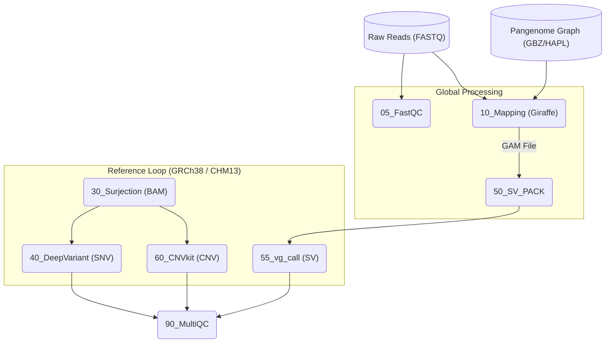

This updated README reflects the **v0.94** architecture, highlighting the transition to a separate configuration file (`pipeline.env`), the dynamic haplotype support for full pangenome graphs, and the memory-optimized throttling logic.

---

# Pangenome WGS Unified Pipeline (v0.94)

A robust, memory-optimized Bash pipeline for Whole Genome Sequencing (WGS) analysis using the **HPRC Pangenome Graph** (v1.1).

This pipeline performs read mapping against a pangenome graph (`vg giraffe`) and projects data onto **two linear references simultaneously** (GRCh38 and CHM13). It outputs fully compliant BAMs, VCFs (SNPs/Indels), Structural Variants (SVs), and Copy Number Variants (CNVs).

## 🚀 Key Features

* **Decoupled Configuration:** Uses `pipeline.env` to manage samples and resources without modifying core logic (Git-friendly).
* **Haplotype-Adaptive Alignment:** Supports both downsampled (`.d9`) and full HPRC graphs with dynamic `-H` haplotype flag logic.
* **RAM Throttling:** Intelligent use of `MEM_THREADS` to prevent OOM (Out of Memory) crashes during high-load steps (`vg pack`, `vg call`, `snarls`).
* **Dual-Reference Output:** Automatically surjects reads to both **GRCh38** and **CHM13** (T2T) coordinate systems.
* **Automatic Cleanup:** Deletes massive intermediate files (`.pack`, `.cnn`) immediately after use to save disk space.

## 🛠️ Pipeline Architecture

### **Phase 1: Global Processing**

1. **Step 05: Reads QC:** Runs **FastQC** on raw inputs.
2. **Step 10: Mapping:** Maps reads to the pangenome graph via `vg giraffe`.
* *Full Graph:* Uses `.hapl` index for haplotype-aware mapping.
* *Downsampled:* Bypasses haplotype flags for efficiency.


3. **Indexing:** Automatically rebuilds `.dist`, `.min`, and `.snarls` if missing.

### **Phase 2: Reference Loop (GRCh38 / CHM13)**

1. **Step 30: Surjection:** Projects graph alignments onto linear coordinates.
2. **Step 40: Small Variants:** Google DeepVariant (WGS model) for SNPs/Indels.
3. **Step 50-55: Structural Variants:** `vg call` identifies SVs directly from graph topology.
4. **Step 60: CNV Calling:** **CNVkit** (WGS mode) with automated flat-reference creation and gender-specific flags.

---

## 📋 Requirements

* **Docker:** All tools run in isolated containers.
* **Hardware:** * *Downsampled (.d9):* 32GB+ RAM.
* *Full HPRC (.gbz):* 64GB-128GB+ RAM.


* **Environment:** A `pipeline.env` file in the script directory.

### Docker Images (Production Tested)

| Tool | Image |
| --- | --- |
| **vg** | `quay.io/vgteam/vg:v1.70.0` |
| **DeepVariant** | `google/deepvariant:1.10.0-beta` |
| **CNVkit** | `etal/cnvkit:0.9.10` |
| **Samtools** | `staphb/samtools:1.19` |

---

## 📜 Setup & Usage

### 1. Configure the Environment

Edit `pipeline.env` to set your sample name, threads, and graph choice.

```bash
# Example pipeline.env snippet
SAMPLE="HG002"
THREADS="16"        # For CPU intensive Mapping
MEM_THREADS="4"     # For RAM intensive Calling
USE_HAPL=true       # Toggle for full pangenome graph

```

### 2. Run the Pipeline

```bash
bash vg_unified_v0.94.sh

```

### 3. Checkpointing

The pipeline creates `completed_steps_${SAMPLE}.txt`. To re-run a specific step (e.g., CNV calling), delete the line `60_GRCh38` from this file and restart the script.

---

## 📉 Visual Workflow



---

**Next Step:** Would you like me to generate a `.gitignore` template to ensure your `pipeline.env` and data directories aren't accidentally tracked in your Git history?